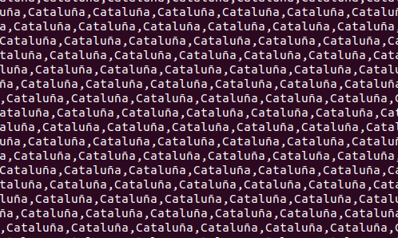
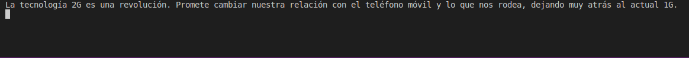

# Code poetry in the loop

[monotema.sh](monotema.sh)

```bash
for ((;;)); do echo -n "Cataluña, "; done
```



---

[revolucion_movil.py](revolucion_movil.py)

```python
#!/bin/python3
import time

for i in range (2,50):
    print('La tecnología %dG es una revolución. Promete cambiar nuestra relación con el teléfono móvil y lo que nos rodea, dejando muy atrás al actual %dG.' % (i, i-1) )
    time.sleep(1)
```



---

[generador_discursos.py](generador_discursos.py)


```python
#!/bin/python3
import random
import itertools

palabras = ['blockchain', 'cuántico', 'inteligencia artificial', 'big data', 'revolución', 'futuro', 'descentralizado','centralizado', 'oportunidad']
discursos = list()

for permutation in itertools.permutations(list(set(palabras)),3):
    discursos.append(permutation)

random.shuffle(discursos)

for d in discursos: 
    for p in d: print(p, end =" "),
    print()
```

```
oportunidad inteligencia artificial descentralizado 
big data cuántico centralizado 
centralizado blockchain revolución 
big data futuro cuántico 
descentralizado revolución inteligencia artificial 
centralizado futuro oportunidad 
cuántico descentralizado futuro 
centralizado oportunidad cuántico 
descentralizado cuántico inteligencia artificial 
cuántico oportunidad descentralizado 
inteligencia artificial revolución centralizado 
cuántico blockchain centralizado 
blockchain revolución cuántico 
blockchain inteligencia artificial futuro 
blockchain futuro revolución 
centralizado oportunidad big data 
revolución big data blockchain 
centralizado descentralizado blockchain 
inteligencia artificial revolución blockchain 
blockchain oportunidad centralizado 
descentralizado futuro oportunidad 
revolución futuro cuántico 
centralizado revolución big data 
futuro cuántico revolución 
blockchain cuántico centralizado 
futuro descentralizado oportunidad 
blockchain futuro centralizado 
inteligencia artificial big data centralizado 
```

